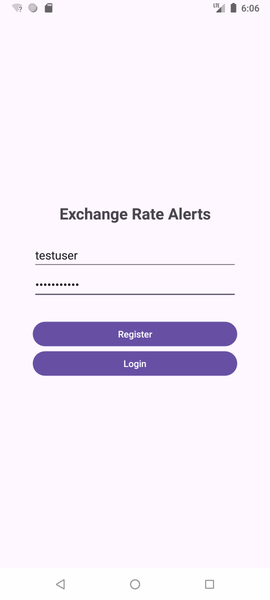
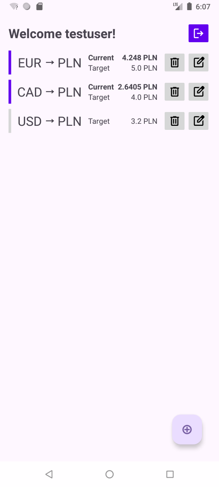
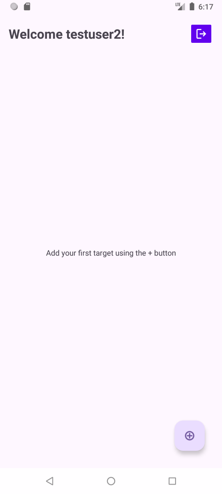
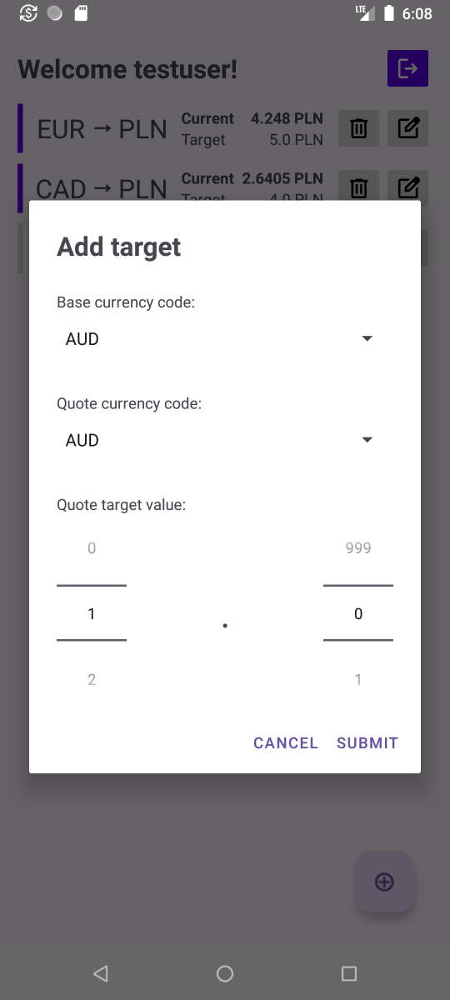
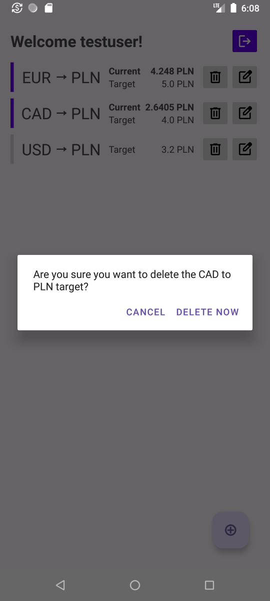
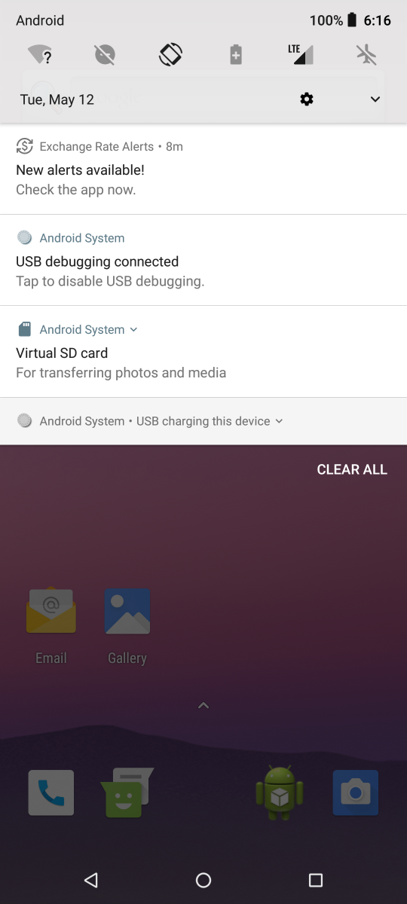

# 💲 Exchange Rate Alerts App

This **Android app** provides a friendly way to use the [Exchange Rate Alerts API](https://github.com/rara64/exchange-rate-alerts-api).
  
The user can set a target currency exchange rate and get notified when the value is at or below the given threshold. Each app user has an account and can add or edit targets at any point. Additionally, when a target is met, the current market rate is shown in the app.
  
The Exchange Rate Alerts App was written in **Java** and created using the **Android Studio IDE** as part of the university group project for the “Mobile App Development” course. Currently, the app targets SDK version 36 and supports a minimum SDK version 25 (Android 7.1).
  
``API_URL`` can be defined in the [build.gradle.kts file](https://github.com/rara64/exchange-rate-alerts-app/blob/main/app/build.gradle.kts#L21).

## Architecture

The app consists of two activities:

* **LoginRegisterActivity** is an activity that opens on app startup and allows the user to log in to an existing account or to register a new one. After the initial login, credentials are stored in the App Preferences (which can only be read by the app) and the user is automatically logged in. A successful login adds a custom worker in the background that every 15 minutes checks for new alerts, and if it finds them, a notification will be sent to the user.
* **TargetsActivity** provides a way to see current targets and quickly look up which targets are met. The user can add a new target via the + button, which opens a custom dialog. Additionally, each target can be edited or removed via the corresponding buttons. Each target is a custom element displayed within a RecyclerView. The user can also decide to log out of the current account on this screen.

The following libraries were used:

* **Retrofit2 and okhttp3** are utilized for connecting with the REST API and converting the data to Java Classes.
* **ndroidx.work:work-runtime** is used for creating a background worker that periodically checks for new alerts and sends a notification.
* **androidx.swiperefreshlayout** to provide a way of refreshing the targets list with a swipe.

## Screenshots

